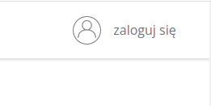
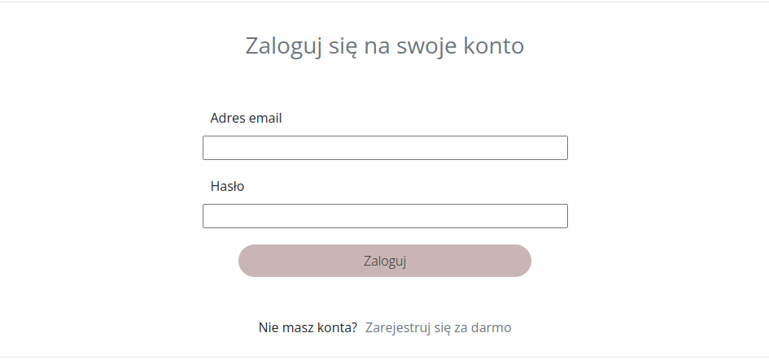
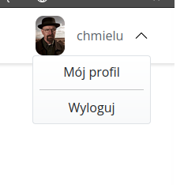
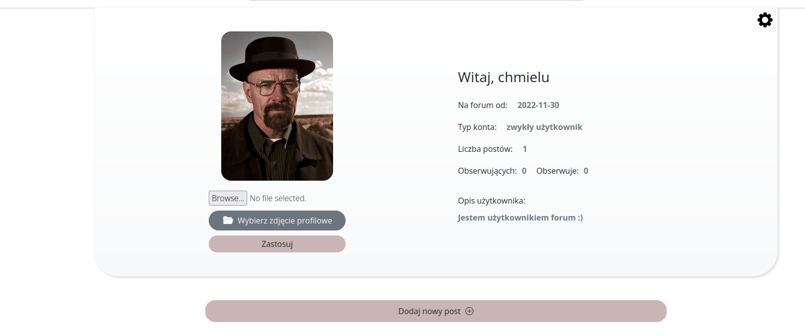
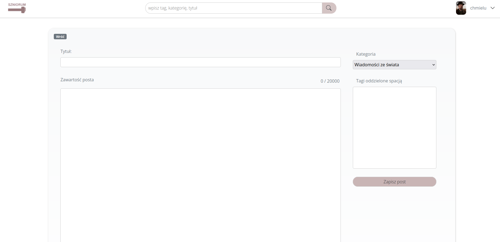
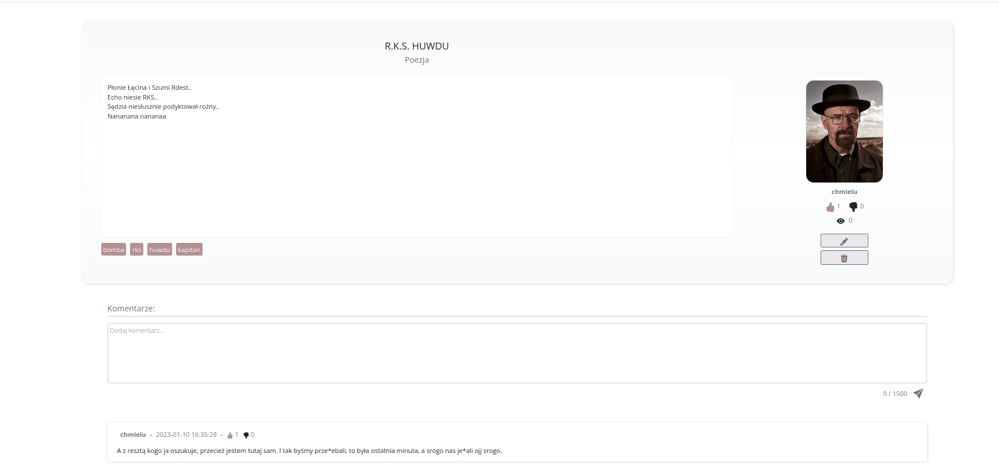

# Wstęp

Witamy w dokumentacji użytkownika forum internetowego Szniorum.  

_Copyright (c) 2023, WiktorProsowicz_

_Redistribution and use in source and binary forms, with or without
modification, are permitted provided that the following conditions are met:_

1. _Redistributions of source code must retain the above copyright notice, this
   list of conditions and the following disclaimer._

2. _Redistributions in binary form must reproduce the above copyright notice,
   this list of conditions and the following disclaimer in the documentation
   and/or other materials provided with the distribution._

_THIS SOFTWARE IS PROVIDED BY THE COPYRIGHT HOLDERS AND CONTRIBUTORS "AS IS"
AND ANY EXPRESS OR IMPLIED WARRANTIES, INCLUDING, BUT NOT LIMITED TO, THE
IMPLIED WARRANTIES OF MERCHANTABILITY AND FITNESS FOR A PARTICULAR PURPOSE ARE
DISCLAIMED. IN NO EVENT SHALL THE COPYRIGHT HOLDER OR CONTRIBUTORS BE LIABLE
FOR ANY DIRECT, INDIRECT, INCIDENTAL, SPECIAL, EXEMPLARY, OR CONSEQUENTIAL
DAMAGES (INCLUDING, BUT NOT LIMITED TO, PROCUREMENT OF SUBSTITUTE GOODS OR
SERVICES; LOSS OF USE, DATA, OR PROFITS; OR BUSINESS INTERRUPTION) HOWEVER
CAUSED AND ON ANY THEORY OF LIABILITY, WHETHER IN CONTRACT, STRICT LIABILITY,
OR TORT (INCLUDING NEGLIGENCE OR OTHERWISE) ARISING IN ANY WAY OUT OF THE USE
OF THIS SOFTWARE, EVEN IF ADVISED OF THE POSSIBILITY OF SUCH DAMAGE._
# Logowanie/Rejestracja

Po wejsciu na forum, pierwszą czynnością jaką należy zrobić aby móc dodawać posty, jest zalogowanie się.   
Aby to zrobić, należy kliknąć w okienko które widnieje w prawym górnym rogu.
  

Następnie zostaniemym przeniesieni do formularza logowania, bądź jesli nie mamy jeszcze konta,
możemy kliknąć w reflink na dole formularza: __Zarejestruj się za darmo__.

Wtedy zostaniemy przeniesieni do forumlarza rejestracji, który musimy wypełnić aby założyć konto.  
Po wypełnieniu formularza, będziemy mogli zalogować się na nasze konto.

# Edycja konta

Po utworzeniu konta, możemy je edytować. Należy ponownie najechać na okienko w prawym górnym rogu -
tym razem będzię widniała tam nasza nazwa użytkownika. Po najechaniu na okienko, rozwinie się menu z którego możemy wybrać: 
* Mój profil
* Wyloguj

Wybieramy pierwszą opcje. 

Zostajemy przeniesieni do panelu naszego konta.

W panelu wyświetlają się podstawowe informacje na temat naszego konta.  
Aby je edytować, należy kliknąć w ikonke _trybiku_ w prawym górnym rogu. Zostaniemy przeniesieni
do panelu edycji, gdzie możemy edytować nasz __opis__ lub __zmienić hasło__.  

Dodatkowo, możemy dodać zdjęcie profilowe naszego konta. Wystarczy, że będziemy je mieć u siebie lokalnie.
Aby to zrobić, należy kliknąć w przycisk: __Wybierz zdjęcie profilowe__.
Po wybraniu należy zatwierdzić przyciskiem: __Zastosuj__ - zostanie ono wtedy skopiowane do bazy danych 
i zapisane jako nasze zdjęcie.

# Dodawanie postów

Aby dodać post należy być zalogowanym użytkownikiem.

Aby dodać post, należy wejść do panelu naszego konta (krok opisany wyżej: __Edycja konta__).  
Następnie, należy kliknąć w przycisk __Dodaj nowy post__, zostanie przeniesieni do panelu tworzenia nowego postu.  

Aby dodać post należy:
* wybrać kategorie
* dodać tytuł postu
* dodać treść postu
* (opcjonalnie) dodać tagi oddzielone spacją
Na koniec wystarczy zapisać post.

# Dodawanie komentarzy

Aby dodać komentarz pod postem należy być zalogowanym użytkownikiem.

Aby dodać komentarz musimy wejść w jakiś post, następnie w dolnej części postu umieszczamy treść
komentarza i klikamy ikonkę wyślij w prawym dolnym rogu.  
Dodatkowo jako autor postu możemy go usunąć lub edytować.

# Dodatkowe informacje
* Na forum mamy dostępną wyszukiwarkę z której możemy korzystać szukająć po tytułach postów lub kategoriach
* Z lewej strony panelu głównego mamy dostępne najpopularniejsze kategorie, które możemy wybrać klikając w nie
* Aby przeglądać posty nie trzeba zakładać konta
* Możemy "lajkować" posty, dzięki czemu bedą one miały większy "zasięg"
* Możemy również "lajkować" komentarze
